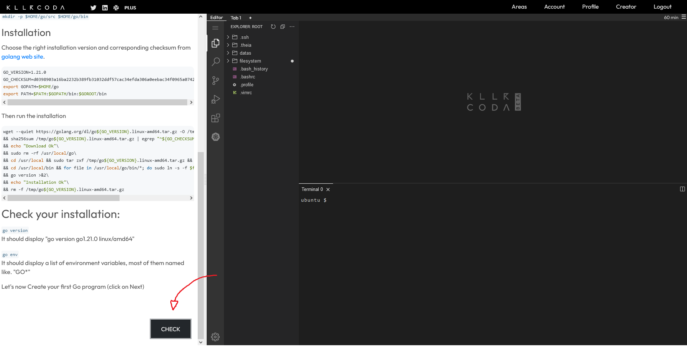
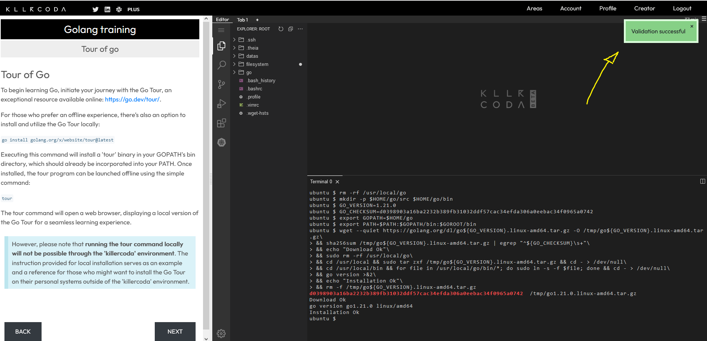
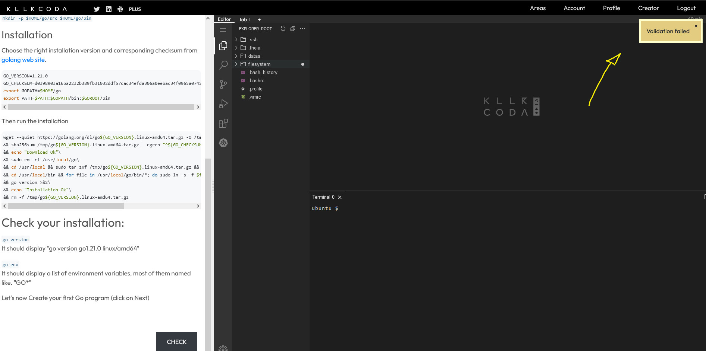
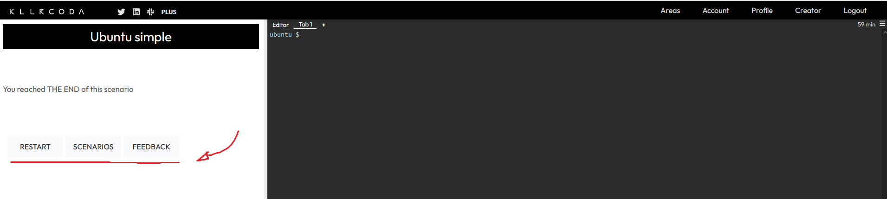

## Actions in the Left Pane

In the left pane, Killercoda scenario scripts offer various available actions. Some of these actions are related to the displayed text, with the primary ones being `Copy` and `Exec`.
- `Copy`: Used to copy the highlighted text to the clipboard.
Let's try : `Copy this !`
- `Exec`: Used to execute the highlighted text in the current terminal.
Let's try : 

```bash
#execute this command
ls -altr
```{{exec}}  

Additional actions are provided for scenario navigation:
- `Back` button: Takes you back to the previous step.
- `Next` button: Moves you to the next step.
- `Check` button: This action initiates a background script that verifies whether the user has met the prerequisites to proceed to the next step. If all prerequisites are met, **a green popup** is displayed, and the next scenario step is presented. Otherwise, **an orange popup appears**, and the user remains on the current step.

### CHECK Button


### NEXT Button and Successfull CHECK


### NEXT Button and Unsuccessfull CHECK


At the conclusion of the scenario, three new buttons will become available:

- `Restart`: This button allows you to restart the current scenario.
- `Scenarios`: Use this button to return to the scenario page.
- `Feedback`: Feel free to click on this button if you'd like to provide feedback to the Killercoda support team.
