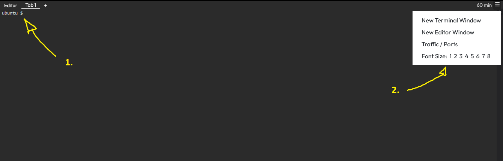

## Right Pane Description

The right pane is utilized for experimentation and executing various training steps.

## Two Different Clients

In the right pane, you can find two main tools:

1. A Terminal:
   

2. Theia Editor:
   

[Theia](https://theia-ide.org/docs/) is a versatile platform for developing full-fledged, multi-language Cloud & Desktop IDE-like products using state-of-the-art web technologies.

## Included Tools

1. On the top left of this pane, you will find two tabs: `Editor` and `Tab1`.
   - `Editor` displays Theia Editor.
   - `Tab1` displays a terminal window.

2. On the top right of this pane, you will find:
   - The remaining time before this training environment closes (60 minutes for guests).
   - A menu to access different tools, including:
     - Opening a new terminal window.
     - Launching a new Theia Editor window.
     - Modifying font size.
     - Most importantly, a tool to access your HTTP services on specific ports.
   
   

## Traffic Port Accessor

The traffic port accessor aims to simplify user access to HTTP services deployed on their training environments. Here are some key points:
- The traffic port accessor exclusively supports the HTTP protocol.
- Access to an HTTP service uses a user-specific URL like `https://ba8e8eaf-0b9a-45e2-a455-cd7da501f5eb-10-244-5-23-1234.spch.r.killercoda.com/`, with this URL provided by the traffic port accessor.
- A distinct URL is composed for each different port.
