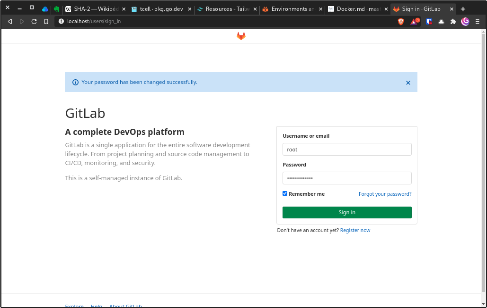
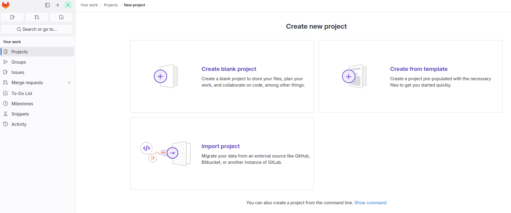
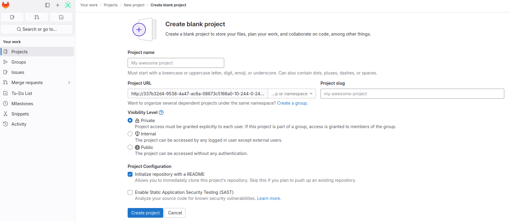
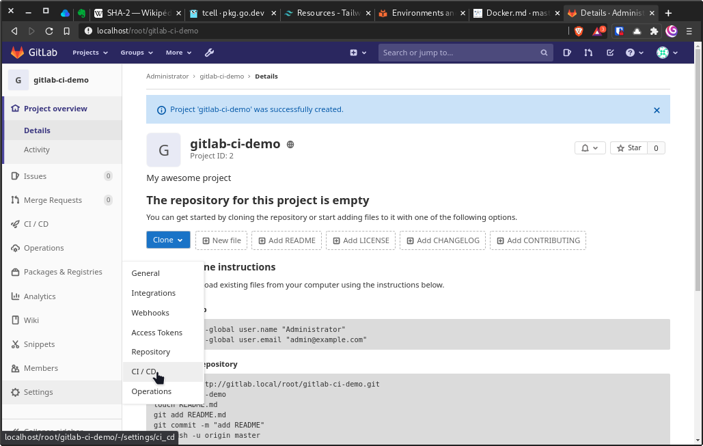
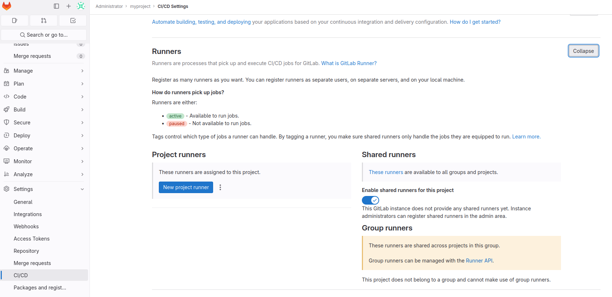
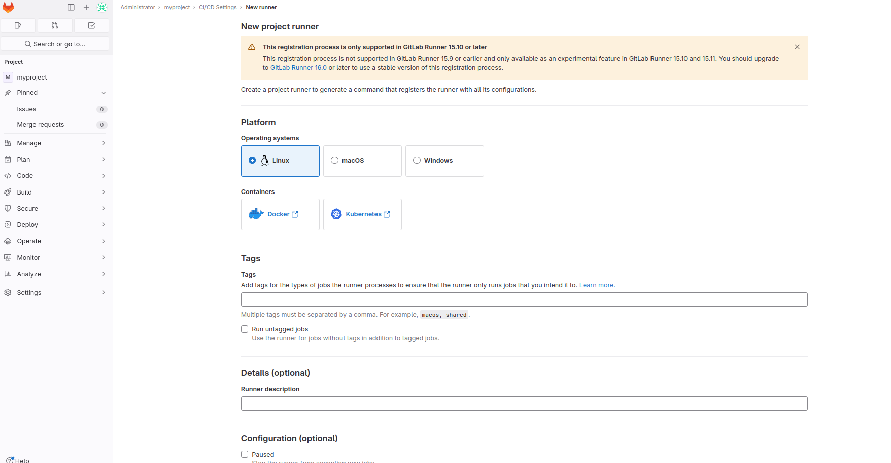
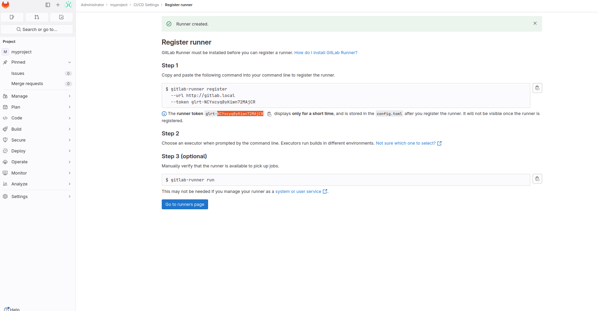

# Configure a gitlab runner

We should now register a gitlab runner.  
We have to use the web interface to finalize the GitLab setup and then **get a registration token** for our runner. 
Follow the following steps:  

## Get the `root` GitLab password.

Open a shell on the gitlab container: `docker exec -it gitlab.local bash`{{exec}}  
In this shell, retrieve initial root password : `cat /etc/gitlab/initial_root_password`{{exec}}  

## Let's play with gitlab UI
- Go to {{TRAFFIC_HOST1_80}}

- Connect to the `root` user using the previously retrieved password.

- Create a new `Project` using the `Create a Project` button.

- Create a blank `Project` using the `Create blank Project` button.

- Enter a project name and Pick a group or namespace where you want to create this project.

- Go to `Settings`/`CI / CD` in your `Project`.

- Expand the runner section.

- Create a new project Runner using `New project runner` button.
- Enter a tag value, use `shared` for example.
- Scroll dow and click on the "Create runner" button.

- copy the `runner token` displayed on the screen

- get back to a terminal, create a file  
`vi ~/RUNNER_TOKEN`{{exec}}  
and insert the token value in the file.

# Next
Once this variable defined, you can move on to the next step by clicking the 'Check' button.  
The check button uses a clone of the script `verify_step2.sh` (that you could find in your HOME) to check that you successfully set the RUNNER_TOKEN variable
