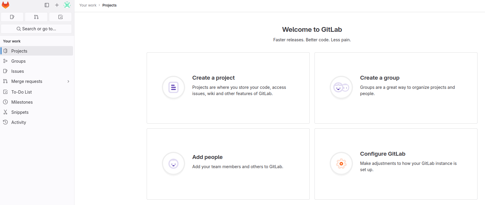
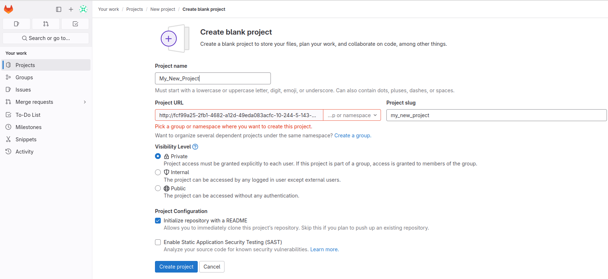

# configure a gitlab runner

We should now register a gitlab runner.  
We have to use the web interface to finalize the GitLab setup and then **get a registration token** for our runner. 
Follow the following steps:  

## Get the `root` GitLab password.

Open a shell on the gitlab container: `docker exec -it gitlab.local bash`{{exec}}  
In this shell, retrieve initial root password : `cat /etc/gitlab/initial_root_password`{{exec}}  

## Let's play with gitlab
- Go to {{TRAFFIC_HOST1_80}}

- Connect to the `root` user using the previously retrieved password.

- Create a new `Project` using the `Create a Project` button.

- Create a blank `Project` using the `Create blank Project` button.

- Go to `Settings`/`CI / CD` in your `Project`.

- Expand the runner section.

- Create a new project Runner using `New project runner` button (use `shared` as tag value for example)

- copy the `runner token` displayed on the screen

- create an envt variable with this token 
`export RUNNER_TOKEN=xxxxxx`` where xxxxx the token value

# Next
Once this variable defined, you can move on to the next step by clicking the 'Check' button.
The check button uses a clone of the script `verify_step2.sh` (that you could find in your HOME) to check that you successfully set the RUNNER_TOKEN variable
