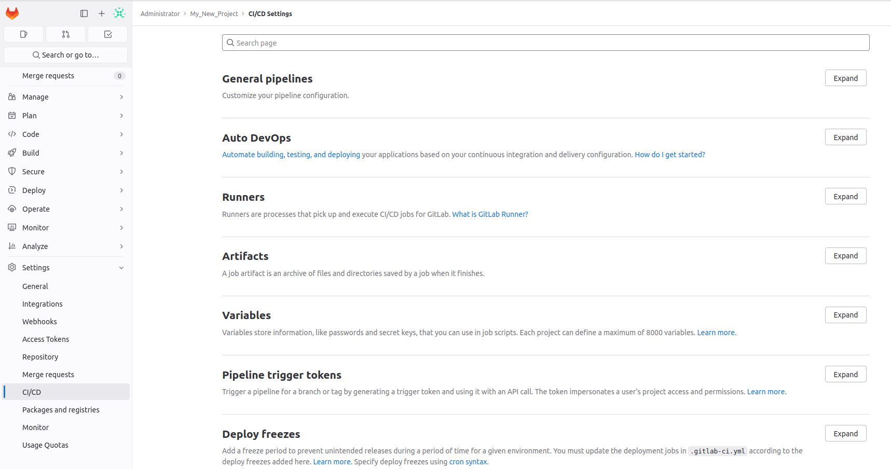

# configure a gitlab runner

Using `docker logs gitlab.local`{{exec}}, you should see a lot of logs and the following error from the runner:  
```shell
runner.gitlab.local | ERROR: Failed to load config stat /etc/gitlab-runner/config.toml: no such file or directory  builds=0
```

The configuration of our Runner is missing, we need to **connect** it to the GitLab server to generate a new one. 
Thus, we must register our runner:  

We have to use the web interface to finalize the GitLab setup and then **get a registration token** for our runner. 
Follow the following steps:  

## Get the `root` GitLab password.

Open a shell on the gitlab container: `docker exec -it gitlab.local bash`{{exec}}  
In this shell, retrieve initial root password : `cat /etc/gitlab/initial_root_password`{{exec}}  

## Let's play with gitlab
- Go to {{TRAFFIC_HOST1_80}}

- Connect to the `root` user using the previously retrieved password.


- Create a new `Project` using the `New Project` button.


- Go to `Settings`/`CI / CD` in your `Project`.


- Expand the runner section.


- Copy the registration token.


# Next
You can move on to the next step by clicking the 'Check' button.
The check button uses a clone of the script verify_step2.sh to check that you successfully
