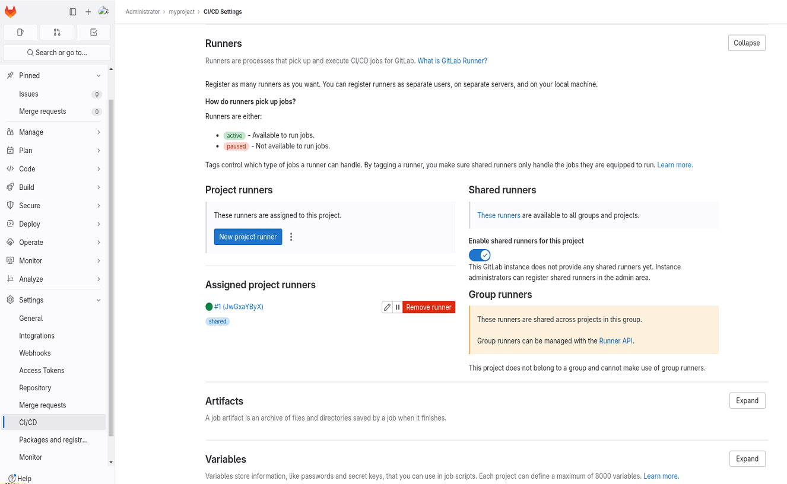

# Register our gitlab runner

Now, we can go back to our shell and **register** our runner:

```shell
$ sudo docker exec -it runner.gitlab.local gitlab-runner register --non-interactive \
	--name demo-runner \
	--url http://gitlab.local \
	--registration-token <your_registration_token> \
	--tag-list docker \
	--executor docker \
	--docker-image docker \
	--docker-network-mode gitlab-network \
	--docker-volumes "/var/run/docker.sock:/var/run/docker.sock"

# --registraton-token: The preiously copied token (you must use the same token for every registration).
# --tag-list: a comma separated list of tag. Useful to assign a job to an executor.
# --executor: The job executor: e.g shell, docker (https://docs.gitlab.com/runner/executors/)
# --docker-network-mode: Place the container in the same network than the GitLab server and thus can access it
# --docker-image: The image of the docker executor
# --docker-volumes: We pass the docker socket as a volume so the Runner will be able to run docker image on the host machine (no docker in docker)

# To see the full list of options
$ sudo docker exec -it runner.gitlab.local gitlab-runner register --help

# A successful GitLab runner registration should print something similar:
Runtime platform                                    arch=amd64 os=linux pid=37 revision=54944146 version=13.10.0
Running in system-mode.                            
                                                   
Registering runner... succeeded                     runner=bfDv-F_b
Runner registered successfully. Feel free to start it, but if it's running already the config should be automatically reloaded! 


# Since we are going to use a shell executor in the GitLab CI examples
# you should also register one as follow:
$ sudo docker exec -it runner.gitlab.local gitlab-runner register --non-interactive \
	--name demo-shell \
	--url http://gitlab.local \
	--registration-token <your_registration_token> \
	--tag-list shell \
	--executor shell

# Finally, if you need to install dependencies for your shell executor:
$ sudo docker exec -it runner.gitlab.local bash
```

> **NOTE**: If you are going to use a **Shell** executor, I recommend you to install `sudo` to login as `gitlab-runner` user. 
> Thus, you can install your dependencies for the `gitlab-runner` user.


If the command return no error, we should see a new `config.toml` file in `gitlab-runner/config` (next to your `docker-compose.yaml` file). 
Thus, we should see our runners in the runner section of the `Settings`/`CI / CD` page of our `project`/`group`:


