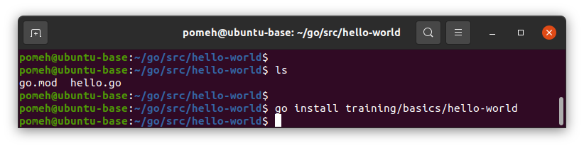
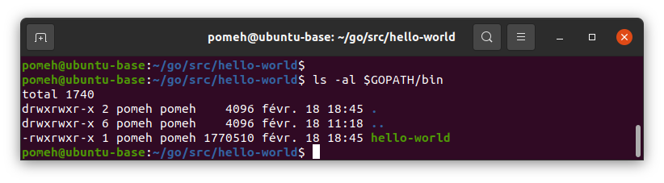
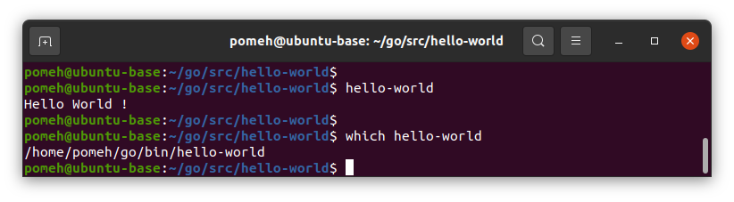
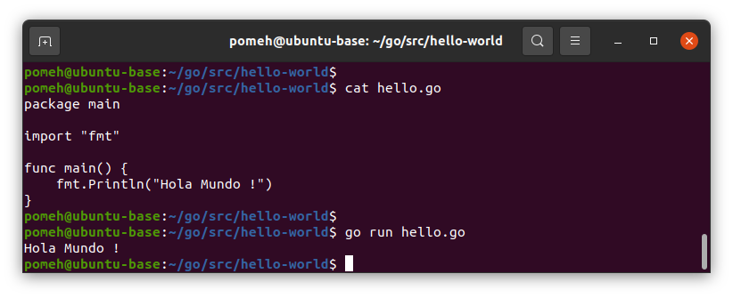

# Hello World !

In this tutorial, you will create your first Go program, the famous and wonderful `Hello World` application.

## Initialization

First, let's create a go/src and a go/bin directory:   
`mkdir -p $HOME/go/src $HOME/go/bin`{{exec}}

In your editor go to the `src` you created: `cd $HOME/go/src`{{exec}}

Create a directory named `hello-world` inside, and go into this directory:

`mkdir hello-world && cd hello-world`{{exec}}

## First module

Now, you will create your first go module, using `go mod` function:

`go mod init training/basics/hello-world`{{exec}}

Let's explore what this command have done. You can use `ls` and `cat` to show the file content:


`go mod` has created a new file, named `go.mod`. This is Go module. It contains the module name we passed in (`"training/basics/hello-world"`), and aditionnal information about Go version (Go `1.17` is used in our example).

Good, but for now, this module contains no code.

## Main source file

Create a file named `hello.go`, and put this initial content:

```
go
package main

import "fmt"

func main() {
    fmt.Println("Hello World !")
}
```{{copy}}

Congratulations, your fist Go file is created ! This is were this tutorial ends.

> But wait ! How do I run this program ?

Good question padawan, let's explore this together.

## Compile time

Go is a compiled language, so we can't run this source file directly: we need to **compile** it by creating an executable (binary) file.

For this, we need to run the `go install` command, along with our module name:

```bash
go install training/basics/hello-world
```



In case of error, the error message is shown in the terminal. But if this command is successful (which should be), it will print nothing.

> And now what ? Where is the binary ?

The Go compiler has kicked in, compiled your source file into a binary file, and stored it inside `$GOPATH/bin` directory:



## Run time !

If you have correctly set up your `$PATH` variable during installation steps, you should be able to run your amazing program using `hello-world` command.

If you don't trust me, you can control that the program you ran is the one located under `$GOPATH/bin` directory too:



> Amazing ! But now, when I change the `hello.go` file, I have to re-run the freaking long `go install` command every time ?

Yes. And no. I mean... It depends !

If you want to try the code, you can use the `go run` command.

For example, edit the `hello.go` file and change the `"Hello World !"` (English) string to `"Hola Mundo !"` (Spanish).

Then, run `go run hello.go`, and see what happens:



This will compile and execute the source file immediately. You don't need to compile it first, which is handy during the development process.

> Caution ! It does not means Go lang is both an interpreted language AND a compiled language. It's a compiled language. When executing `go run`, an intermediate binary file is created in a temporary directory, but you don't notice it.

But if you want the binary output creation, the `go install training/basics/hello-world` command from earlier can be shortened.

In our working directory, the following commands are all equivalent:

```bash
go install training/basics/hello-world
go install .
go install
```

For convenience, go commands accept paths relative to the working directory, and default to the package in the current working directory if no other path is given.

Another possibility is running `go build` command. This is similar to `go run` as it will create a binary file, but this file will be placed in the current directory, instead of `$GOPATH/bin` directory for `go install`.

So a typical dev process would be:

1. `go run file.go` to try the source file in a quick way
1. control that the code behaves as expected
1. `go build` to compile the source file locally
1. run that binary file, and check everything is fine
1. `go install` to compile and make it available globally on the system

That's all folks ! You can continue your go training by learning [how to read environment variables](../02-environment-variable/README.md) and display a message based on the user speaking language.
