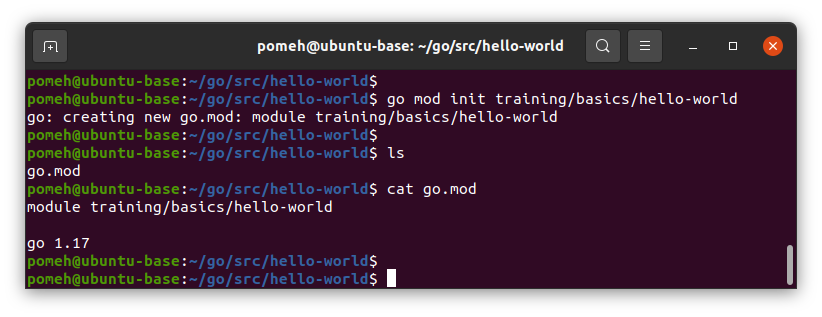

# Hello World !

In this tutorial, you will create your first Go program, the famous and wonderful **Hello World** application.

## Initialization

In your editor go to the **src** directory you created: `cd $HOME/go/src`{{exec}}

Create a sub-directory named `hello-world`, and go into this directory:

`mkdir hello-world && cd hello-world`{{exec}}

## First module

Now, you will create your first go module, using **go mod** function:

`go mod init training/basics/hello-world`{{exec}}

Let's explore what this command have done. You can use **ls** and **cat** to show the file content:



**go mod command** has created a new file, named **go.mod**. This is Go module. It contains the module name we passed in (**"training/basics/hello-world"**), and aditionnal information about Go version (Go **1.21** is used in our example).

Good, but for now, this module contains no code.

## Main source file

In the theia editor, go to folder **go/src/hello-world** and create a file named **hello.go**.  
Put this initial content:  

```
package main

import "fmt"

func main() {
    fmt.Println("Hello World !")
}
```{{copy}}

Congratulations, your fist Go file is created ! This is were this tutorial ends.

> But wait ! How do I run this program ?

Good question padawan, let's explore this together by clicking on the "Next" button.
